# NOVA Store 🛍️ (Flutter)

A clean e-commerce Flutter app showcasing categories, promo banners, flash sales, ratings, stock indicators, and a cart flow.

## 📸 App Screenshots

  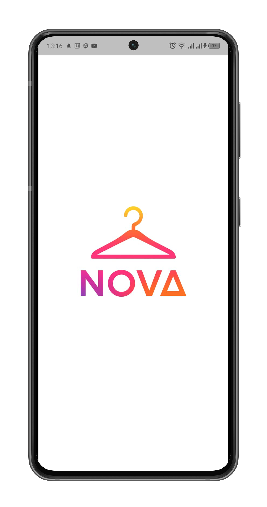
  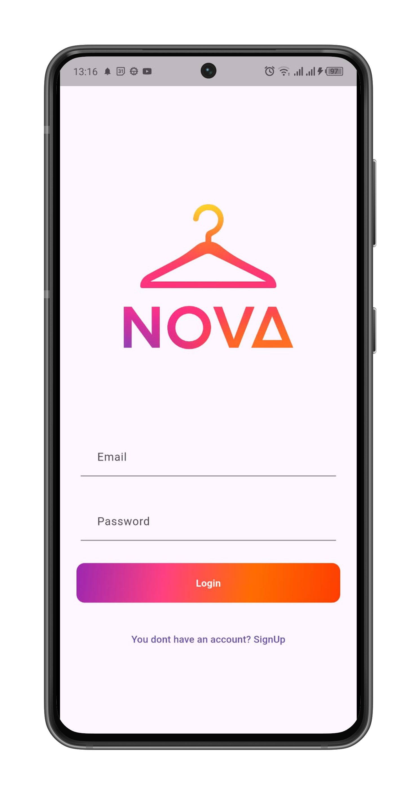
  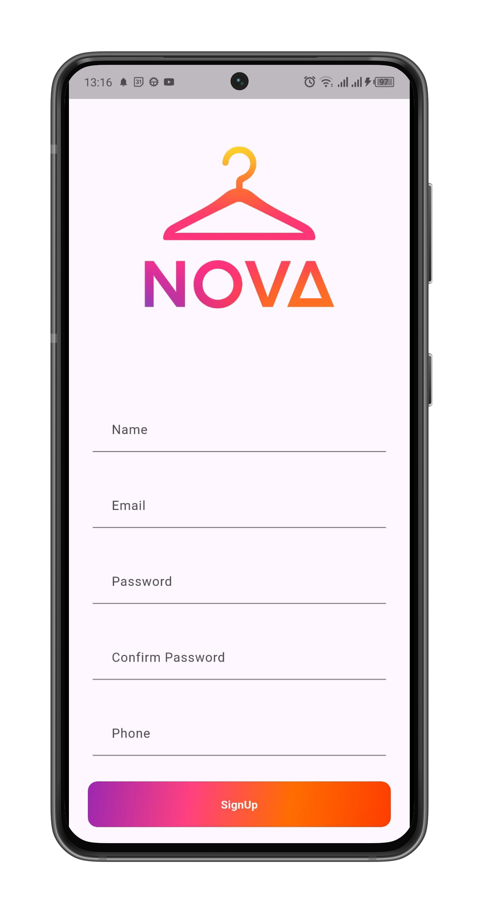

  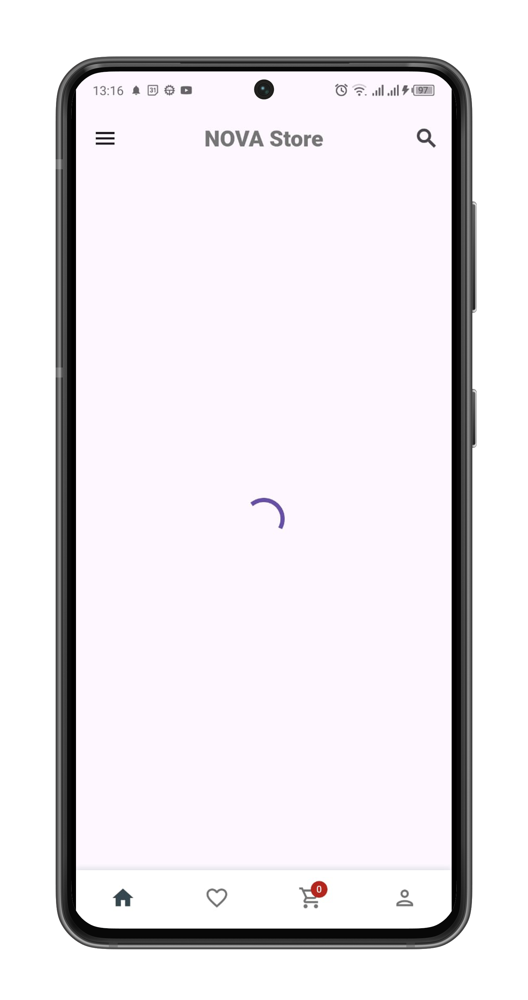
  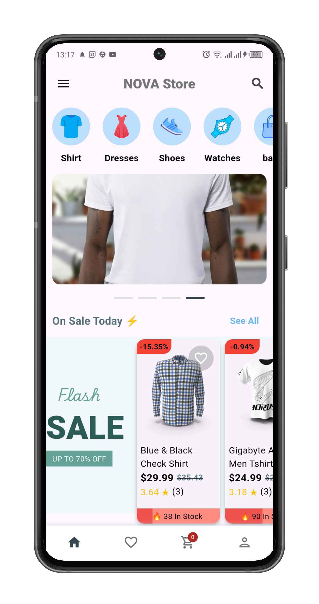
  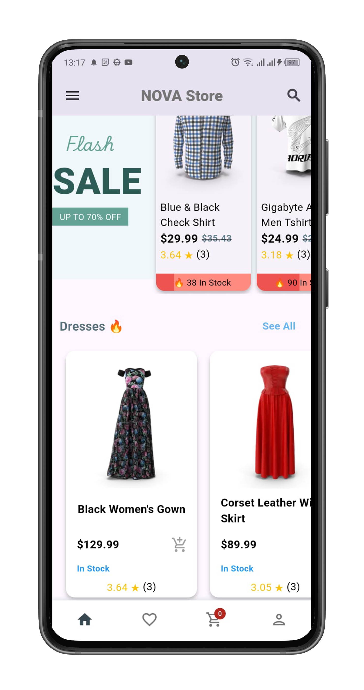

  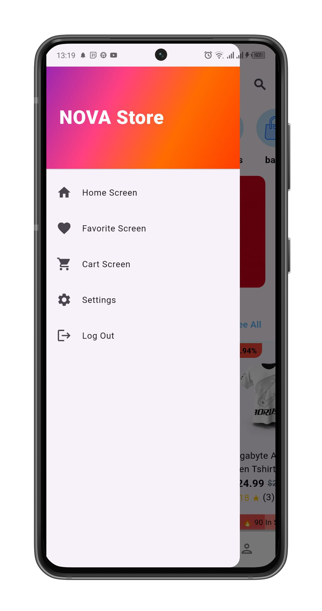
  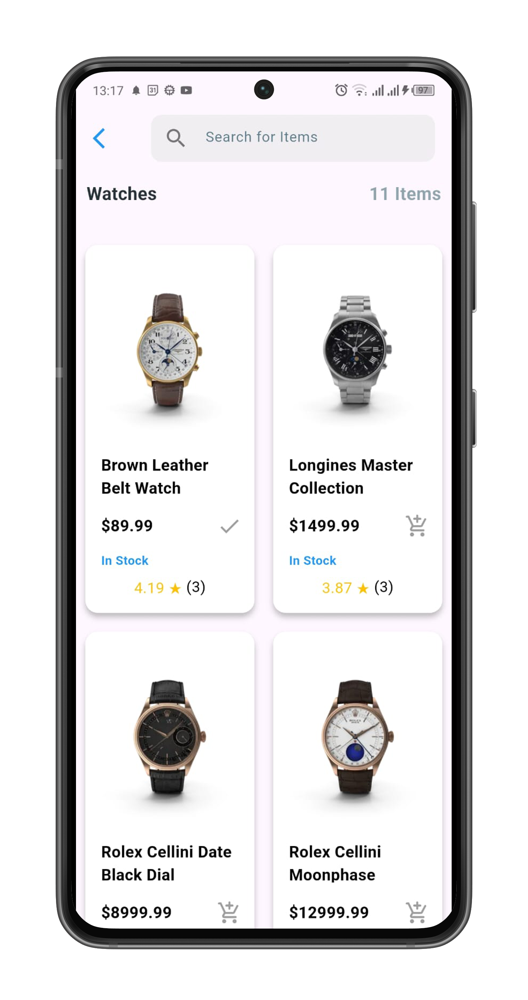
  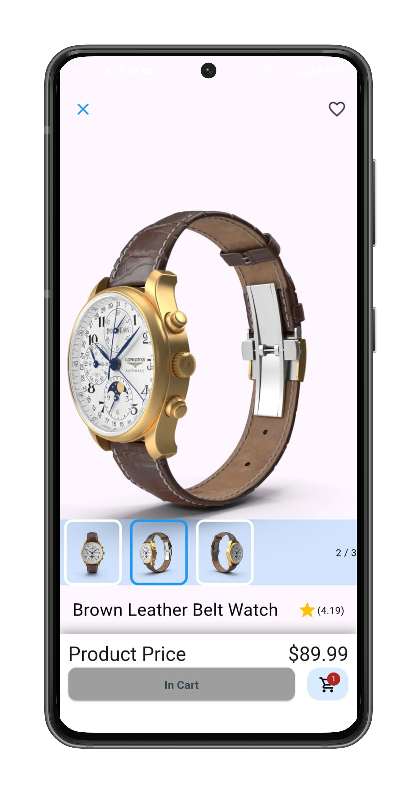

  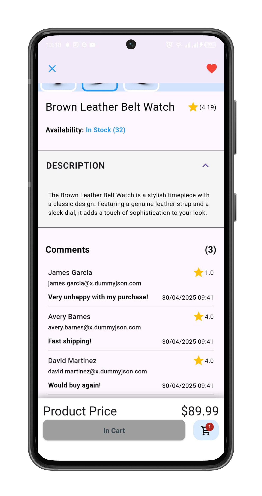
  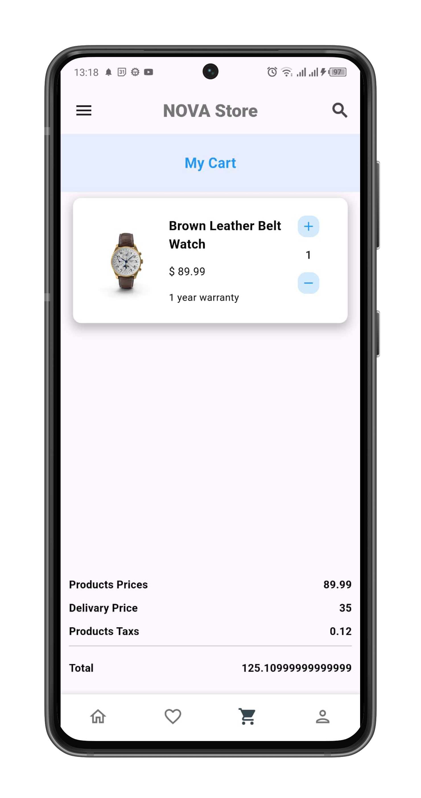
  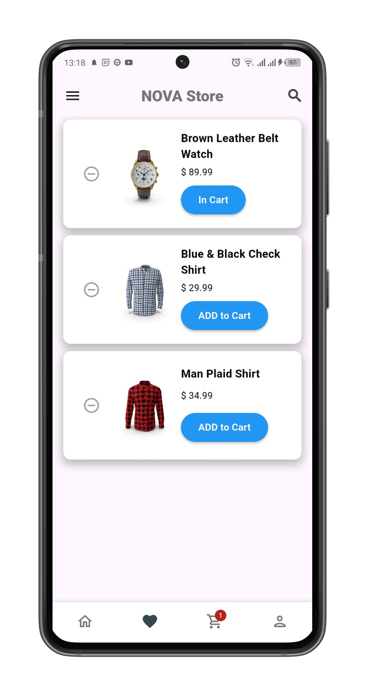

---

## ✨ Features
- Category chips & promotional banner slider  
- Flash Sale section with discounts & stock badges  
- Product grid with price, rating, and “in stock” label  
- Cart badge and add-to-cart actions  
- Search & “See All” navigation  
- Clean, modern Flutter UI (supports Android)

## 📦 Tech Stack
- Flutter, Dart  
- (State management) Bloc / Cubit  
- Material 3 widgets & custom UI components

## 📱 Download APK
👉 **[Download the latest APK](https://github.com/bahaaalhout/Nova-Store/releases/latest/download/app-release.apk)**

